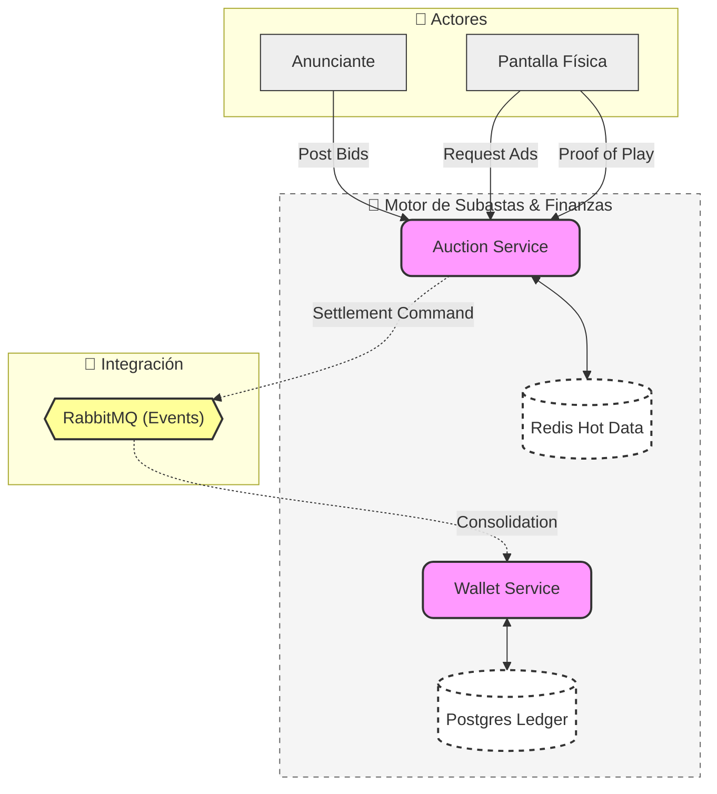

# 🛰️ Bidcast: Plataforma RTB para DOOH

**Bidcast** es un ecosistema de microservicios para la gestión y subasta de publicidad en pantallas físicas (Digital Out-of-Home). El sistema permite a los anunciantes pujar por espacios publicitarios en tiempo real y a las pantallas obtener el contenido más rentable basándose en algoritmos de subasta.

## 🏛️ Arquitectura del Sistema

## 🛠️ Stack Tecnológico

*   **Lenguaje**: Java 21.
*   **Framework**: Spring Boot 4.0.3 (con Virtual Threads).
*   **Base de Datos**: PostgreSQL 16 & Redis 7.
*   **Mensajería**: RabbitMQ.
*   **IA Agent**: Desarrollado con el soporte de **Gemini CLI**.
*   **Testing**: JUnit 5, Mockito & Testcontainers (Alpine).

## 🚀 Estado del Proyecto

### 1. Auction Service (RTB Engine)
*   **Redis-Only**: Centralización de datos calientes (Sets, Metadata JSON y Saldos Atómicos).
*   **Funcional**: Algoritmo de subasta implementado con Java Streams puros.
*   **Resiliente**: Mecanismo de **Self-Healing** para reconstrucción automática de memoria desde Postgres.
*   **Seguro**: Validación stateless de reproducciones mediante **HMAC-SHA256**.

### 2. Wallet Service (Ledger)
*   **Garantía**: Control de saldos con soporte para presupuestos congelados (Reservas).
*   **Eficiencia**: Liquidación de sesiones mediante procesamiento asíncrono vía RabbitMQ.

## 🎯 Próximos Pasos

*   Integración con pasarela de pagos (Stripe).
*   Dashboard para anunciantes (Frontend React/TS).
*   API Gateway y seguridad JWT.
*   Monitoreo y observabilidad de latencias.
