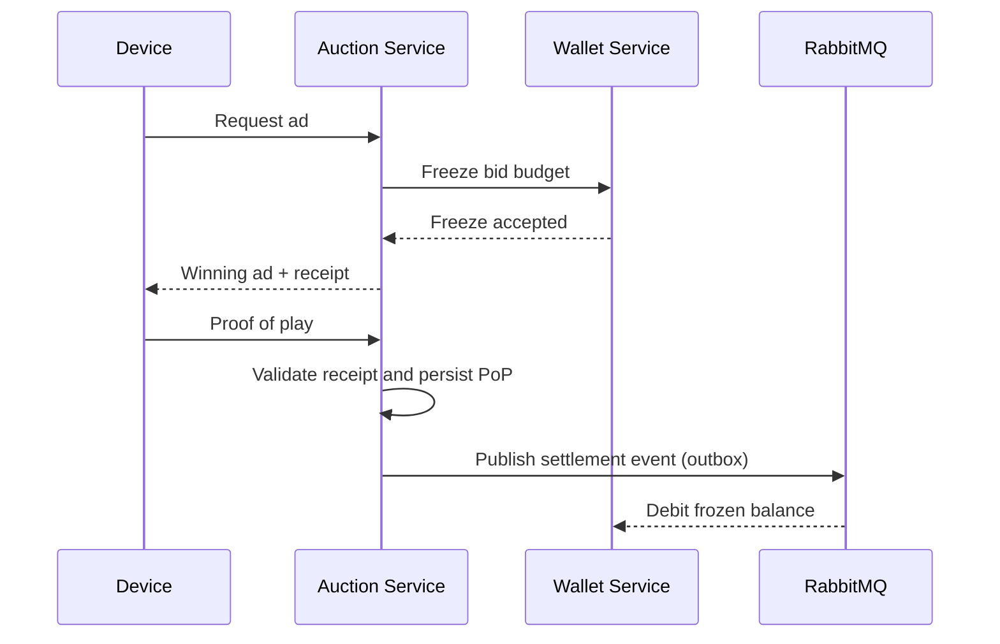

# Bidcast

Bidcast is a personal microservices project inspired by AdTech real-time bidding systems.
It connects advertisers, physical display devices, auctions, and internal financial flows in a distributed architecture designed to explore concurrency, consistency, idempotency, and service-to-service communication.

The project is intentionally more infrastructure-heavy than a typical CRUD application. The goal was not just to "build features", but to work through the kinds of problems that appear when money, retries, distributed state, and asynchronous messaging all interact.

> Work in progress focused on distributed systems and backend engineering, not on shipping a polished end-user product.

## What This Project Explores

- real-time auction execution for ad delivery on physical screens
- stateless authentication with JWT at the gateway edge
- internal wallet and settlement flows with idempotency protections
- external payment integration through Mercado Pago webhooks
- asynchronous communication with RabbitMQ
- distributed state and fast-path coordination with Redis
- transactional boundaries, outbox delivery, and reconciliation jobs
- unit, web, and integration testing with Testcontainers

## Architecture

Bidcast follows a service-oriented architecture with clear separation between identity, routing, auction execution, financial accounting, external billing, and inventory management.

- PostgreSQL is used where auditability and transactional guarantees matter.
- Redis is used for low-latency state, distributed coordination, and rate limiting.
- RabbitMQ is used for cross-service event delivery.

### Services

- `gateway-service`: API gateway, JWT validation, RBAC, header normalization, rate limiting, CORS
- `user-service`: registration, login, password hashing, JWT issuance
- `device-service`: device inventory and owner-based lookup
- `advertisement-service`: campaign creation and advertiser campaign management
- `auction-service`: session bids, auction execution, proof-of-play validation, outbox-based settlement orchestration
- `wallet-service`: internal ledger, credits, debits, frozen balance handling, settlement consumption
- `billing-service`: Mercado Pago checkout preference creation and webhook reconciliation

## Main Flow

At a high level, the platform works like this:

1. an advertiser registers and authenticates through `user-service`
2. the `gateway-service` validates the JWT and forwards verified identity to internal services
3. advertisers create campaigns and allocate budget
4. devices participate in active sessions
5. `auction-service` receives bids, selects a winner, and issues a receipt token
6. when the ad is confirmed as displayed, proof of play is recorded
7. settlement is published through the outbox and consumed by `wallet-service`
8. wallet balance can be topped up through `billing-service`

### Auction / Settlement Flow



## Reliability Patterns

The project includes several patterns that are common in systems where consistency and retries matter:

- multi-layer idempotency using fast-path checks plus database constraints
- optimistic locking and duplicate handling on financial flows
- transactional outbox for durable event publication
- reconciliation jobs for stale or incomplete distributed flows
- signed receipt validation before final settlement
- gateway-side identity shielding through trusted internal headers only
- Redis-backed distributed rate limiting

These choices are deliberate. Some are arguably overkill for a greenfield MVP, but they were included to force exposure to real backend trade-offs.

## Tech Stack

- Java 21
- Spring Boot 4.0.3
- Spring MVC and Spring Cloud Gateway WebFlux
- Spring Security
- PostgreSQL
- Redis (Redisson)
- RabbitMQ
- JJWT
- Testcontainers
- Maven
- Docker / Docker Compose

## Repository Layout

```text
bidcast/
├── gateway-service/
├── user-service/
├── device-service/
├── advertisement-service/
├── auction-service/
├── wallet-service/
├── billing-service/
├── docker-compose.yml
└── init.sql
```

Each service has its own `README.md` with implementation notes and testing details.(work in progress)

## Running The Project

### 1. Start infrastructure and available services

The repository includes a root [`docker-compose.yml`](docker-compose.yml) that starts:

- PostgreSQL
- Redis
- RabbitMQ
- `gateway-service`
- `user-service`
- `wallet-service`
- `auction-service`
- `billing-service`

Run:

```bash
docker compose up --build
```


Use the corresponding service `README` for required environment variables and endpoint details.

## Testing

The codebase uses a mix of:

- unit tests for business rules and edge cases
- web/controller tests for HTTP contracts
- integration tests with Testcontainers for services that depend on PostgreSQL, Redis, or RabbitMQ

Most service modules can be tested independently:

```bash
cd auction-service
mvn test
```
Some integration suites require Docker Desktop or Docker Engine because they spin up real infrastructure with Testcontainers.
