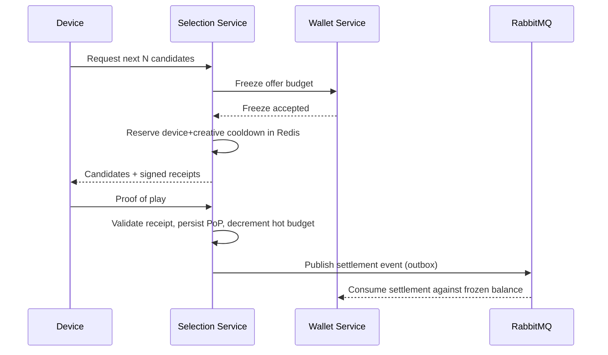

# Bidcast

Bidcast is a personal microservices project inspired by AdTech systems, focused on slot-based ad delivery on physical screens rather than classic impression-by-impression RTB.
Advertisers compete to occupy playback slots, devices request the next candidates to show, and the platform coordinates wallet freezes, proof-of-play validation, and settlement across services.

The project is intentionally backend- and infrastructure-heavy. The goal is to practice concurrency, idempotency, distributed state, payments, asynchronous messaging, and recovery patterns in a realistic multi-service environment.

> Work in progress centered on distributed systems and backend engineering, not on a polished end-user product.

## What This Project Explores

- slot-based ad selection for playback on physical screens
- stateless authentication with JWT at the gateway edge
- internal wallet freezing and settlement flows
- proof-of-play validation with signed receipts
- asynchronous communication with RabbitMQ
- hot-path state and coordination with Redis and Redisson
- transactional outbox delivery
- rehydration and recovery after hot-state loss
- unit, web, and integration testing with Testcontainers

## Architecture

Bidcast follows a service-oriented architecture with a separation between identity, routing, inventory, campaign management, selection, wallet accounting, and billing.

- PostgreSQL is used where auditability and transactional guarantees matter.
- Redis is used for hot-path state, cooldowns, locks, and fast operational reads.
- RabbitMQ is used for cross-service event delivery.

## Services

Services currently present in the repository:

- `gateway-service`: API gateway, JWT validation, RBAC, header normalization, rate limiting, CORS
- `user-service`: registration, login, password hashing, JWT issuance
- `venue-service`: venue and device inventory
- `advertisement-service`: campaign and creative management
- `selection-service`: session offers, candidate selection, proof-of-play validation, Redis hot state, outbox-driven settlement orchestration
- `wallet-service`: internal ledger, credits, debits, frozen balance handling, settlement consumption
- `billing-service`: Mercado Pago checkout preference creation and webhook reconciliation

## Current Selection Model

The core delivery flow currently lives in `selection-service`:

- advertisers register a `SessionOffer` for a session
- each offer has a `pricePerSlot`, total budget, cooldown configuration, and a list of creative snapshots
- the service returns the next `N` candidates for a device
- each candidate already includes a concrete creative, slot duration, and a signed receipt
- local `device + creative` cooldown is reserved when the candidate is returned
- `Proof of Play` confirms actual playback, charges the real total (`pricePerSlot * slotCount`), and updates global campaign recency

This is closer to continuous playback selection than to classic web RTB.

### Selection / Settlement Flow



## Reliability Patterns

The project includes several patterns commonly used in distributed systems:

- multi-layer idempotency for `PoP`
- signed receipt validation before charging playback
- Redis hot state plus DB-backed rehydration
- Redisson lock per session for concurrent selection
- transactional outbox for durable event publication
- settlement reconciliation against persisted `ProofOfPlay`
- gateway-side identity shielding using trusted internal headers
- Redis-backed distributed rate limiting

Some of these go beyond what a minimal MVP would need, but they are included deliberately to explore real trade-offs around consistency, retries, and operational safety.

## Tech Stack

- Java 21
- Spring Boot 4.0.3
- Spring MVC and Spring Cloud Gateway
- Spring Security
- PostgreSQL
- Redis and Redisson
- RabbitMQ
- JJWT
- Testcontainers
- Maven
- Docker / Docker Compose

## Repository Layout

```text
bidcast/
├── gateway-service/
├── user-service/
├── venue-service/
├── advertisement-service/
├── selection-service/
├── wallet-service/
├── billing-service/
├── docker-compose.yml
└── init.sql
```

Each service has its own `README.md` with module-specific notes and testing details.

## Running The Project

The root [`docker-compose.yml`](docker-compose.yml) currently starts:

- PostgreSQL
- Redis
- RabbitMQ
- `gateway-service`
- `user-service`
- `wallet-service`
- `selection-service`
- `billing-service`
- `venue-service`

Run:

```bash
docker compose up --build
```

Some services in the repository, such as `advertisement-service`, may be developed and tested independently even if they are not currently included in the default compose startup.

Check the corresponding service `README` files for environment variables and endpoint details.

## Testing

The codebase uses a mix of:

- unit tests for business rules and edge cases
- web/controller tests for HTTP contracts
- integration tests with Testcontainers for services that depend on PostgreSQL, Redis, or RabbitMQ

Example:

```bash
cd selection-service
./mvnw clean test
```

Some integration suites require Docker Desktop or Docker Engine because they start real infrastructure with Testcontainers.
